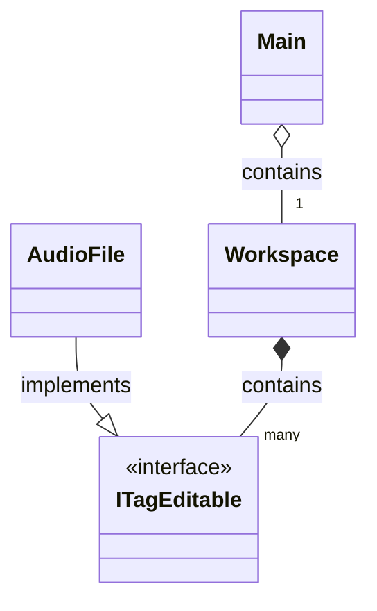
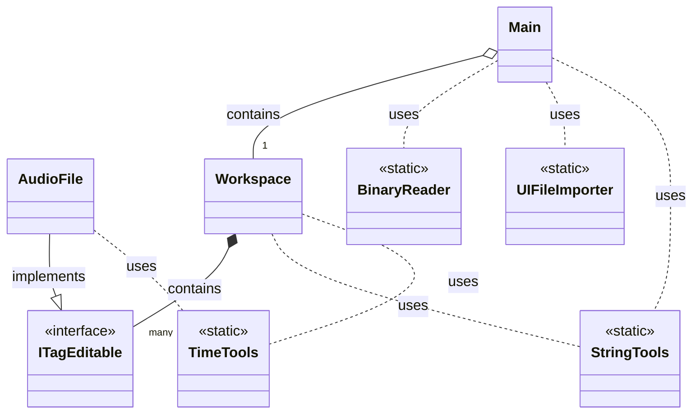

# Editor MP3 tagů

## Zadání práce

Program slouží pro editaci tagů u mp3 souborů. Uživatel si do tzv. workspace (dále ws) naimportuje mp3 soubory, se kterými bude chtít nějakým způsobem pracovat. Program bude nabízet operace pro jednotlivé soubory (editace tagu, výpis informací, přejmenování podle tagu) a hromadné operace pro všechny soubory ve ws (výpis do txt, hromadné přejmenování, hromadná editace tagu). Pro zjednodušení se pracuje pouze s ID3v2 (ideálně ID3v2.3) tagy: číslo stopy, skladba, interpret, album a rok. Program navíc umožňuje výpis informací o tagu přečtených binárně přímo ze souboru a také několik metod řazení skladeb ve ws.

## Návrh řešení

### Funkční specifikace

Menu v aplikaci je kombinací zadávání příkazů a vybírání z číselného seznamu. Po spuštění je uživateli vypsán obsah ws; program si pamatuje, jaká složka byla otevřena naposledy (uloženo v `data/state.audiows`). Skladby ve ws jsou vypsány pod sebou, hodnoty sloupců jsou: číslo skladby ve ws, interpret, rok, album, číslo stopy, název, délka a absolutní cesta k souboru. Uživatel může následně psát příkazy:

* `open` – Vybrat novou složku, ze které se importují soubory do ws
* `clear` – Odebrat vše z ws
* `help` – Zobrazit nápovědu
* `exit` – Ukončit aplikaci
* Napsat číslo skladby ve ws pro provedení akce s danou skladbou, poté se zobrazí číselné menu:
  * `1` Změna interpreta
  * `2` Změna roku
  * `3` Změna alba
  * `4` Změna čísla stopy
  * `5` Změna názvu skladby
  * `6` Přejmenování podle tagu – při volbě nového názvu souboru lze použít "modifikátory" `/i`, `/y`, `/a`, `/n` a `/t` pro vložení hodnot z tagu do názvu souboru; nepovolené znaky jsou nahrazeny podtržítkem
  * `7` Odebrat soubor z ws (pokud nechceme, aby byl zařazen do příkazů ze sady `all`)
  * `8` Vyčíst informace o tagu ze souboru (binárně) – program se pokusí binárně přečíst ID3v2.3 header a vypsat vše, co najde  
* `all` – Provést akci pro všechny soubory ve ws, výběr z číselného menu:
  * `1` Hromadná změna intepreta pro všechny soubory ve ws
  * `2` Hromadná změna roku pro všechny soubory ve ws
  * `3` Hromadná změna alba pro všechny soubory ve ws
  * `4` Hromadné přejmenování podle tagů – pokud nastane situace, že by se více souborů mělo jmenovat stejně, je přejmenován pouze jeden a akce je předčasně ukončena
  * `5` Generace textového souboru `description.txt`, kde jsou pod sebou vypsány soubory tak, jak jsou seřazeny ve ws (lze tedy změnit pomocí `sort`); každý řádek obsahuje timestamp, který by skladbě náležel, kdyby se nacházela v jednom dlouhém videu (audiu); timestamp je youtube friendly (po vložení do popisku videa youtube automaticky vygeneruje kapitoly); lze použít stejné "modifikátory" jako u přejmenování
* `sort` – Seřadit soubory ve ws, výběr z číselného menu:
  * `1` Seřadit podle názvu souboru
  * `2` Seřadit podle interpret - rok - číslo stopy
  * `3` Seřadit podle roku
  * `4` Seřadit podle délky skladby

### Struktura vstupních a výstupních souborů

* Do ws lze naimportovat korektní (=nepoškozené) soubory s příponou .mp3 (název jakýkoliv), pokud nemají ID3v2 tag, bude jim vytvořen
  * Aby mohl být binárně přečten (číslo skladby → `8`), musí se jednat o tag ID3v2.3.x (čtcrtý bajt musí být roven třem) a nemít nastavené žádné flagy (šestý bajt musí být roven nule)
* Cesta k ws uložena v `data/state.audiows` je zapsána pomocí `writeUTF` a čtena pomocí `readUTF`
* Soubor `description.txt` (`all` → `5`) obsahuje na každém řádku timestamp ve formátu "(hh):(m)m:ss" (na prvním řádku je vždy 0:00); co následuje po timestampu, si volí uživatel

### Class diagram

#### Základ



#### Komplet



## Externí knihovna

* [mp3agic](https://github.com/mpatric/mp3agic)

### Příklady použití

```java
private Mp3File file;
private ID3v2 tag;

// ...

file = new Mp3File(path);
if (file.hasId3v2Tag()) {
    tag = file.getId3v2Tag();
}
else {
    tag = new ID3v23Tag();
    file.setId3v2Tag(tag);
}
if (file.hasId3v1Tag()) {
    file.removeId3v1Tag();
}

// ...

String absolutePath = file.getFilename();
String artist = tag.getArtist();
String year = tag.getYear();
String album = tag.getAlbum();
String trackNum = tag.getTrack();
String title = tag.getTitle();

// ...

tag.setArtist(newArtist);
tag.setYear(newYear);
tag.setAlbum(newAlbum);
tag.setTrack(changeTrackNum);
tag.setTitle(newTitle);
```


## Požadavky

### Funkční a technické požadavky na aplikaci

1. Menu, které umožní opakovaný výběr funkcí aplikace a ukončení aplikace ✓
2. Přehledný výpis výsledků na konzoli - použijte alespoň jednou String.format() a StringBuilder ✓
3. Načítání vstupních dat z minimálně dvou souborů ✓
4. Zápis výstupních dat do souboru ✓
5. Možnost práce s textovými a binárními soubory (alespoň někde) ✓
6. Ideálně využití reálných otevřených dat
7. Adresář data se všemi datovými soubory a případně třídu Datastore se statickými metodami, které budou poskytovat další statická data ✓
8. Tri balíčky:
   1. `ui` – třídy, tvořící uživatelské rozhraní - komunikaci s uživatelem ✓
   2. `app` – třídy, tvořící logiku s daty aplikace - modely, kontrolery ✓
   3. `utils` – pomocné třídy např. vlastní výjimky, vlastní rozhraní ✓
9. Programování vůči rozhraní a použití vlastního rozhraní ✓
10. Použití java.time API pro práci s časem ✓
11. Použít enum typ ✓
12. Použití kontejnerové třídy jazyka Java (ArrayList, LinkedList, HashMap ...) z Collections frameworku ✓
13. Alespoň dvě možnosti třídění s využitím rozhraní Comparable a Comparator ✓
14. Použití regulárního výrazu ✓
15. Ošetření vstupů, aby chybné vstupy nezpůsobily pád programu - pomocí existujících a vlastních výjimek
16. Vhodné ošetření povinně ošetřovaných výjimek
17. Použití Vámi vybrané externí knihovny (audio, posílání emailů, práce s obrázkem, junit testování, jiné formáty uložení dat ...) ✓
18. Javadoc - každá třída a metoda musí mít javadoc popis, abyste mohli na závěr vygenerovat javadoc dokumentaci ✓

### Dokumentace

Dokumentace obsahuje zjednodušené fáze analýzy, designu a přípravy na testování, které se píšou před samotným kódováním. Dokumentaci vytvořte jako README ve Vašem GitHub projektu.

* Zadání práce
  * Problém (motivace)
  * Navrhované řešení
* Návrh řešení
  * Funkční specifikace – seznam funkcí z pohledu uživatele, které bude Váš program poskytovat např. formou větveného seznamu (stromu). Může sloužit následně jako podklad pro menu
  * Popis struktury vstupních a výstupních souborů – jaké datové typy bude obsahovat, čím budou odděleny jednotlivé údaje, jestli je požadovaný určitý formát názvů souborů apod.
  * Class diagram - pomocí nějakého nástroje např. diagrams.net
* Příprava na testování. Vytvořte testovací soubory. Vstupní soubory naplňte testovacími daty v minimálním rozsahu 20 (řádků). Napište sadu 10 testů - při zadaných konkrétních vstupech uživatele, jaké jsou očekávané konzolové výstupy. Sada by měla obsahovat testy funkcionality programu pro běžné i limitní stavy jako i testy ošetření vstupů
* Popis fungování externí knihovny

### Zdrojový kód

* Snažte se dodržet a využít principy objektového programování
* Důraz klaďte na funkčnost a přehlednost kódu. KISS – Keep It Simple and Smart
* Používejte smysluplné názvy proměnných
* Vymažte z programu nepotřebný kód (alternativní řešení) kromě testovacích main metod

### Prezentace

* V zápočtovém týdnu předvedete Vaší aplikaci a spolužáci Vám ji otestují.  
* Připravte si slidy, kde představíte
  * zadání
  * objektový návrh - rozdělení do tříd (zjednodušený class diagram)
  * způsob použití externí neprobírané knihovny
