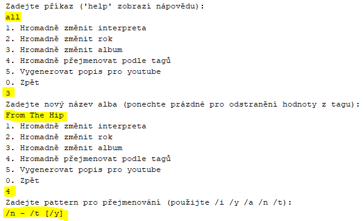

# Editor MP3 tagů


## Zadání práce

Program slouží pro editaci tagů u mp3 souborů. Uživatel si do tzv. workspace (dále ws) naimportuje mp3 soubory, se kterými bude chtít nějakým způsobem pracovat. Program bude nabízet operace pro jednotlivé soubory (editace tagu, výpis informací, přejmenování podle tagu) a hromadné operace pro všechny soubory ve ws (výpis do txt, hromadné přejmenování, hromadná editace tagu). Pro zjednodušení se pracuje pouze s ID3v2 (ideálně ID3v2.3) tagy: číslo stopy, skladba, interpret, album a rok. Program navíc umožňuje výpis informací o tagu přečtených binárně přímo ze souboru a také několik metod řazení skladeb ve ws.

## Návrh řešení

### Funkční specifikace

Menu v aplikaci je kombinací zadávání příkazů a vybírání z číselného seznamu. Po spuštění je uživateli vypsán obsah ws; program si pamatuje, jaká složka byla otevřena naposledy (uloženo v `data/state.audiows`). Skladby ve ws jsou vypsány pod sebou, hodnoty sloupců jsou: číslo skladby ve ws, interpret, rok, album, číslo stopy, název, délka a absolutní cesta k souboru. Uživatel může následně psát příkazy:

* `open` – Vybrat novou složku, ze které se importují soubory do ws
* `clear` – Odebrat vše z ws
* `help` – Zobrazit nápovědu
* `exit` – Ukončit aplikaci
* Napsat číslo skladby ve ws pro provedení akce s danou skladbou, poté se zobrazí číselné menu:
  * `1` Změna interpreta
  * `2` Změna roku
  * `3` Změna alba
  * `4` Změna čísla stopy
  * `5` Změna názvu skladby
  * `6` Přejmenování podle tagu – při volbě nového názvu souboru lze použít "modifikátory" `/i`, `/y`, `/a`, `/n` a `/t` pro vložení hodnot z tagu do názvu souboru; nepovolené znaky jsou nahrazeny podtržítkem
  * `7` Odebrat soubor z ws (pokud nechceme, aby byl zařazen do příkazů ze sady `all`)
  * `8` Vyčíst informace o tagu ze souboru (binárně) – program se pokusí binárně přečíst ID3v2.3 header a vypsat vše, co najde  
* `all` – Provést akci pro všechny soubory ve ws, výběr z číselného menu:
  * `1` Hromadná změna intepreta pro všechny soubory ve ws
  * `2` Hromadná změna roku pro všechny soubory ve ws
  * `3` Hromadná změna alba pro všechny soubory ve ws
  * `4` Hromadné přejmenování podle tagů – pokud nastane situace, že by se více souborů mělo jmenovat stejně, je přejmenován pouze jeden a akce je předčasně ukončena
  * `5` Generace textového souboru `description.txt`, kde jsou pod sebou vypsány soubory tak, jak jsou seřazeny ve ws (lze tedy změnit pomocí `sort`); každý řádek obsahuje timestamp, který by skladbě náležel, kdyby se nacházela v jednom dlouhém videu (audiu); timestamp je youtube friendly (po vložení do popisku videa youtube automaticky vygeneruje kapitoly); lze použít stejné "modifikátory" jako u přejmenování
* `sort` – Seřadit soubory ve ws, výběr z číselného menu:
  * `1` Seřadit podle názvu souboru
  * `2` Seřadit podle interpret - rok - číslo stopy
  * `3` Seřadit podle roku
  * `4` Seřadit podle délky skladby

### Struktura vstupních a výstupních souborů

* Do ws lze naimportovat korektní (=nepoškozené) soubory s příponou .mp3 (název jakýkoliv), pokud nemají ID3v2 tag, bude jim vytvořen
  * Aby soubor mohl být binárně přečten (číslo skladby → `8`), musí se jednat o tag ID3v2.3.x (čtvrtý bajt musí být roven třem) a nemít nastavené žádné flagy (šestý bajt musí být roven nule)
* Cesta k ws uložena v `data/state.audiows` je zapsána pomocí `writeUTF` a čtena pomocí `readUTF`
* Soubor `description.txt` (`all` → `5`) obsahuje na každém řádku timestamp ve formátu "(hh):(m)m:ss" (na prvním řádku je vždy 0:00); co následuje po timestampu, si volí uživatel

### Class diagram

#### Zjednodušeno


## Příklad použití

Scénář: uživatel má složku s mp3 soubory, u kterých by rád změnil nějaké tagy:


* Nejprve si tuto složku musíme přidat do workspace příkazem `open` a následným vybráním složky v dialogu:
* (Příkazy zadané uživatelem jsou vyznačeny žlutě)


* Nyní jsou soubory přidány do ws
* Čtvrtý soubor ve výpisu má špatně nastavený název interpreta, vybereme ho tedy zadáním čísla `4`
* Otevře se nám menu s akcemi pro jeden soubor, zadáme `1` pro změnu interpreta a zadáme nový název:


* Soubor má nyní změněný tag:


* Dále bychom rádi opravili název alba pro všechny skladby najednou
* Příkazem `all` otevřeme menu s hromadnými akcemi pro všechny skladby
* Zadáním `3` vybereme hromadnou změnu názvu alba a zadáme nový název
* Poté bychom rádi přejmenovali všechny soubory ve formátu _\<číslo stopy\> - \<název skladby\> \[\<rok\>\]_
* V nabídce zadáme `4` pro hromadné přejmenování a zadáme pattern `/n - /t [/y]`:



* Soubory nyní mají změněné album a jsou přejmenovány:


* Nakonec bychom chtěli seřadit skladby podle jejich délky a v tomto pořadí vygenerovat popis pro youtube s patternem _\<název skladby\> by \<název interpreta\>_
* Příkazem `sort` otevřeme nabídku pro seřazení skladeb ve výpisu, možnost `4` je seřadí podle délky
* Příkazem `all` a možností `5` generujeme popis pro yt, jako pattern zadáme `/t by /y`:


* Takto vypadá vytvořený soubor:


## Externí knihovna

* [mp3agic](https://github.com/mpatric/mp3agic)

### Příklady použití

```java
private Mp3File file;
private ID3v2 tag;

// ...

file = new Mp3File(path);
if (file.hasId3v2Tag()) {
    tag = file.getId3v2Tag();
}
else {
    tag = new ID3v23Tag();
    file.setId3v2Tag(tag);
}
if (file.hasId3v1Tag()) {
    file.removeId3v1Tag();
}

// ...

String absolutePath = file.getFilename();
String artist = tag.getArtist();
String year = tag.getYear();
String album = tag.getAlbum();
String trackNum = tag.getTrack();
String title = tag.getTitle();

// ...

tag.setArtist(newArtist);
tag.setYear(newYear);
tag.setAlbum(newAlbum);
tag.setTrack(newTrackNum);
tag.setTitle(newTitle);
```
